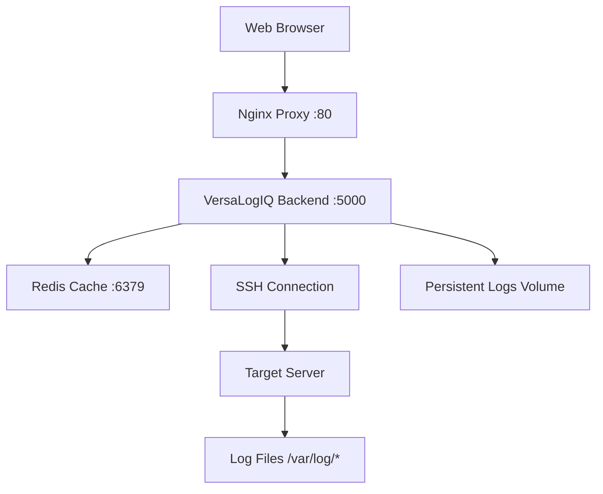

# VersaLogIQ - Quick Start Guide

## 🚀 What is VersaLogIQ?

VersaLogIQ is a **Docker-based microservices application** that provides intelligent log analysis and server management capabilities through a web interface. Built from the VMS-Tool-Web reference application, it focuses specifically on log processing and system analysis.

## 📁 Project Structure

```
VersaLogIQ/
├── 📁 backend/                         # Main application backend
│   ├── 📄 versalogiq_app.py           # Flask-SocketIO main application
│   ├── 📄 requirements.txt            # Python dependencies
│   ├── 📁 templates/
│   │   └── 📄 index.html               # Web interface template
│   └── 📁 logs/                       # Application logs directory
├── 📁 config/                         # Configuration files
│   └── 📁 nginx/
│       └── 📄 nginx.conf               # Nginx reverse proxy config
├── 📄 Dockerfile                      # Backend container definition
├── 📄 docker-compose.yml              # Multi-service orchestration
├── 📄 .dockerignore                   # Docker build exclusions
├── 📄 deploy.sh                       # Deployment management script
├── 📄 .env.example                    # Environment configuration template
└── 📄 README.md                       # Comprehensive documentation
```

## ⚡ Quick Start (5 minutes)

### Prerequisites
- Ubuntu 22.04.5 LTS
- Docker 28.3.3+
- docker-compose 1.29.2+

### 1. Deploy the Application
```bash
cd /home/versa/pgudipati/SAMBA-70-188-169/VersaLogIQ
./deploy.sh start
```

### 2. Access the Application
- **Web Interface**: http://localhost:5000
- **Via Nginx**: http://localhost  
- **Health Check**: http://localhost:5000/health

### 3. Connect to a Server
1. Fill in server credentials in the web interface
2. Click "Connect"
3. Wait for automatic log scanning to complete
4. Select log files to analyze

## 🎯 Key Features Implemented

### ✅ Core Requirements Met
- [x] **Same GUI as reference app** - Adapted HTML/CSS/JS from VMS-Tool-Web
- [x] **Docker microservices architecture** - Multi-container deployment
- [x] **Connection management** - SSH with success/failure handling
- [x] **Error popups** - Detailed error analysis with troubleshooting steps
- [x] **GUI reset on disconnect** - Clean state management
- [x] **Log processing** - Automatic scanning and content display

### 🔧 Technical Implementation
- **Backend**: Flask-SocketIO with Paramiko for SSH
- **Frontend**: Socket.IO client with progressive UI
- **Containerization**: Docker with multi-service compose
- **Networking**: Nginx reverse proxy with health checks
- **Storage**: Persistent volumes for logs and configuration

## 📊 Architecture Overview



## 🛠️ Management Commands

```bash
# Start services
./deploy.sh start

# Check status  
./deploy.sh status

# View logs
./deploy.sh logs

# Health check
./deploy.sh health

# Stop services
./deploy.sh stop

# Clean shutdown
./deploy.sh clean
```

## 🔍 Troubleshooting

### Common Issues

**Docker not running**
```bash
sudo systemctl start docker
sudo systemctl enable docker
```

**Port conflicts**
```bash
sudo netstat -tulpn | grep -E ':(80|5000|6379)'
```

**Container build issues**
```bash
docker system prune -f
./deploy.sh start
```

**SSH connection problems**
- Check server accessibility: `ping <server-ip>`
- Verify SSH service: `ssh user@server-ip`
- Review error popup details in web interface

## 📈 Next Steps

### Phase 2 Enhancements (Future)
- [ ] Log parsing and analytics
- [ ] Real-time log monitoring
- [ ] Log search and filtering
- [ ] Dashboard and visualizations
- [ ] Multi-server management
- [ ] Alert and notification system
- [ ] API endpoints for integration
- [ ] SSL/TLS encryption
- [ ] User authentication and authorization
- [ ] Log data export capabilities

### Integration Opportunities
- Connect with monitoring systems (Prometheus/Grafana)
- Integration with SIEM platforms
- API development for external tools
- Webhook support for alerts
- Database integration for log storage

## 📞 Support

### Quick Diagnostics
```bash
# Full system check
./deploy.sh health

# Collect diagnostic information
docker-compose ps
docker-compose logs > diagnostics.log
```

### Performance Monitoring
```bash
# Monitor resource usage
docker stats

# Check disk usage
docker system df
```

---

**VersaLogIQ v1.0** - Successfully created and ready for deployment!  
Built with Docker microservices architecture, featuring the same GUI as the reference application with enhanced log processing capabilities.